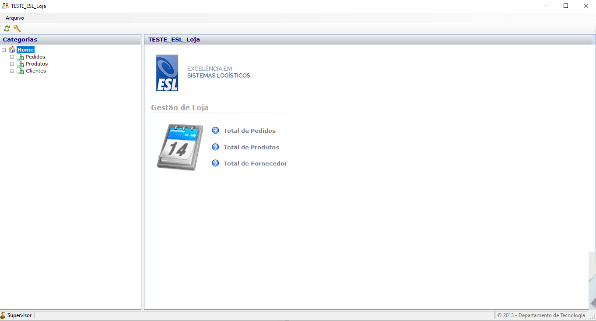
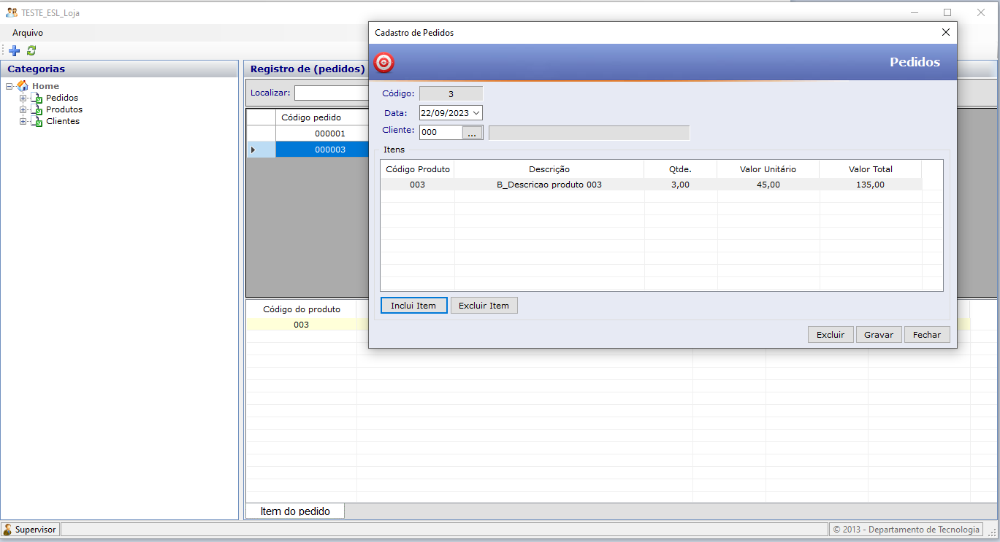

# SISTEMA TESTE EM CSHARP - DESKTOP
 
<h2 align="Left">foto01</h2>
<h1 align="center">
    
</h1>
 
## Sistema de Cadastro de Produtos, Clientes e Pedidos em CSHARP
Um sistema de Cadastro de Produtos, Clientes e Pedidos é uma ferramenta essencial para empresas que desejam gerenciar suas operações de vendas de forma eficiente. Na plataforma desktop, a linguagem de programação C# oferece uma solução poderosa e flexível para a criação de tal sistema.
 
<h2 align="Left">foto02</h2>
<h1 align="center">
    
</h1>
 
## Cadastro de Produtos:
O cadastro de produtos é a base do sistema, permitindo que a empresa liste e gerencie todos os produtos que ela vende. Cada produto pode conter informações como nome, descrição, preço, quantidade em estoque e outras características específicas, como código de barras. Com a capacidade de adicionar, atualizar e excluir produtos, o sistema facilita o controle do inventário e a atualização dos preços e informações dos produtos.

## Cadastro de Clientes:
O sistema também permite o registro de informações de clientes. Isso inclui dados como nome, endereço, número de telefone e e-mail. O cadastro de clientes é fundamental para rastrear compras e manter um histórico de relacionamento com os clientes. Isso também pode ser útil para a criação de promoções personalizadas e para melhorar o atendimento ao cliente.

## Gestão de Pedidos:
Uma das características mais cruciais do sistema é a gestão de pedidos. Os funcionários podem criar novos pedidos selecionando produtos e associando-os a clientes. O sistema calcula automaticamente o valor total do pedido com base nos produtos selecionados. Além disso, o sistema deve permitir a busca por pedidos anteriores e a atualização do status de cada pedido (como "Em Processamento", "Enviado" ou "Entregue").

## Relatórios e Estatísticas:
O sistema também pode incluir recursos para gerar relatórios e estatísticas. Isso permite que a empresa analise suas vendas, identifique produtos populares e tome decisões estratégicas com base em dados reais.

## Segurança e Acesso:
Para garantir a segurança dos dados, o sistema deve implementar recursos de autenticação e autorização. Apenas usuários autorizados devem ter acesso a funções administrativas, como a adição de novos produtos ou a atualização de informações de clientes.

## Resumo:
Em resumo, um sistema de "Cadastro de Produtos, Clientes e Pedidos" na linguagem C# para plataforma desktop é uma ferramenta valiosa para empresas que desejam otimizar suas operações de vendas. Ele oferece um meio eficiente de gerenciar produtos, clientes e pedidos, tornando o processo de vendas mais organizado e eficaz. Além disso, proporciona informações valiosas para a tomada de decisões estratégicas e o aprimoramento do relacionamento com os clientes.

